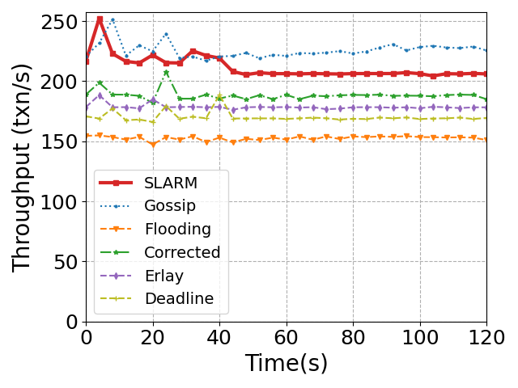

# Table of Contents
- [Motivation of Gap-filling](#motivation-of-gap-filling)
- [Q&A](#qa)
- [References](#references)
  * [New References](#new-references)
  * [References in Paper](#references-in-paper)

# Motivation of Gap-filling 

> SLARM performs gap-filling for two kinds of transactions. First, SLARM
> performs gap-filling for real-time transactions, which can help the current
> consensus node to collect more SLA stringent transactions before proposing the
> next block. Second, SLARM performs gap-filling for smart contract
> transactions. Smart contracts are stateful programs; different execution
> orders of transactions can lead to different results. For instance, an IoT
> blockchain system [1] updates the temperature/humidity variables of smart
> contracts using the temperature/humidity data (i.e., transaction) received
> from sensors connected to the blockchain. If the transactions are executed out
> of order, the variables on smart contracts cannot reflect the real
> temperature/humidity, which may cause severe security issues. Therefore,
> transactions invoking smart contracts must be executed in order. If the
> consensus nodes receive smart contract transactions with gaps, all smart
> contract transactions cannot be proposed. To prevent transaction delay caused
> by gaps, SLARM performs a two-phase gossip-correction transaction
> dissemination protocol to fill-gaps in the received smart contract
> transactions as well as real-time transactions that require fast commit. 
# Q&A

<!-- **1 Why we didn't adopt a structured network, which can provide even lower
bandwidth consumption and convergence latency?**

> SLARM, as well as typical blockchain message multicast protocols, is
> unstructured. The routing decisions are made independently by every P2P node
> based on their local views. This form of data multicast protocol is
> reliable, but not the most efficient, as it results in redundant transmissions
> and may lead to a large number of message collisions. 
>
> This is not the case with structured multicast protocols. For instance, a
> structured protocol can organize P2P nodes into a tree topology, and transmit
> messages over the tree structure (parent send to children). Structured
> disseminate protocols can reduce redundant transmissions and achieve lower
> bandwidth consumption in normal cases, but, on the other hand, they are very
> fragile (e.g., partition) in the presence of failures, lacking the natural
> resilience of unstructured protocols. 
> 
> A blockchain network is consist of heterogeneous nodes with diverse network
> conditions. Nodes can leave or join the network without asking for permission.
> Some critical applications such as trading are embedded with blockchain,
> making blockchain susceptible to various attacks. Therefore, the network
> topology of SLARM is still unstructured. -->

**1 Why most SLA transactions can meet their SLA deadline in SLARM if we set the
SLA transactions' deadlines as *2\*T* (An extra explanation of Section 4.3)?**

> In Section 4.3, we have already proved that the end-to-end commit latency of
> transactions disseminated by Gossip follows Poisson distribution, so setting
> transactions' SLA deadline as *2\*T* can ensure a high SLA satisfaction rate
> (e.g. 96%).
> 
> Here we provide extra prove that the end-to-end commit latency of transactions
> disseminated by SLARM also follows the Poisson distribution. The end-to-end
> latency of a transaction is consist of the dissemination latency and the
> consensus latency. Because the consensus latency is a constant (Section 7.1),
> we prove that the dissemination latency of SLA transactions in SLARM follows
> the Poisson distribution. 
> 
> In SLARM, the SLA transactions are disseminated with a two-phase
> Gossip-correction (fill gap) protocol. SLARM adopts a light-weight gap-filling
> protocol to fix the missed transactions at each hop during Gossip. Because
> each node only requests for lost transactions from one-hop peers, this
> gap-filling latency at each hop is stable. Moreover, the total number of hops
> for an SLA transaction to be disseminated to all P2P nodes is concentrated
> around its mean value *log(N)*. Therefore, the latency caused by gap-filling
> can be regarded as a constant. The entire dissemination latency of an SLA
> transaction is the sum of the Gossip latency and the gap-filling latency. As
> we have already proved that the latency of Gossip transaction dissemination
> follows the Poisson distribution, the total dissemination latency of SLARM's
> SLA transactions also follows the Poisson distribution. Therefore, if we set
> the SLA transactions' deadlines as *2\*T*, most SLA transactions can meet
> their SLA deadline in SLARM.

<!-- > Since SLA transactions need to be
> executed in the nonce order, when an SLA transaction reaches the consensus
> nodes, it cannot be proposed until the current consensus node has received all
> previous SLA transactions with smaller nonces.  -->

**2 Extra explanation of Figure 1 in the paper.**

    
    
     
    
Extended Figure 1: SLA guarantee for SLA transactions and throughputs for all transactions (30Mbps bandwidth, 5000 nodes). 

> **Extended Figure 1:** An extended figure to show the SLA guarantees for SLA
>transactions and throughputs for all transactions of the online trading
>application. Our paper (Figure 1, Page 2, left column) only shows a part of the
>entire experiment (the blue region). 
>
> **Setting (same with paper):** 30Mbps bandwidth, 5000 nodes.
> 
>**Experiment (same with paper):** We compared the SLA satisfaction rates and
>throughputs of SLARM with three reliable multicast protocols (i.e., Deadline
>Gossip [30], Corrected Gossip [35], Erlay [51]), the traditional Gossip, and
>the flooding. At 0s, SLA (70%, all invoke smart contracts) and non-SLA (30%)
>transactions are submitted to the network until peak throughput; at 48s, a
>spike of 200 txn/s SLA transactions lasts for 5s.
> 
>**Extra explanation:** Before traffic spikes (***0s-48s***), all protocols
>except for Gossip can achieve high SLA satisfaction rates (i.e., transactions
>are disseminated and proposed in time under low workload). However, the SLA
>satisfaction rate of Gossip is low and unstable even without transaction spikes
>(about 80%, sometimes decreases to 60%). The key reason is that Gossip only
>provides a probabilistic delivery guarantee: Each transaction can only reach a
>fraction of all P2P nodes. Many gaps exist in the SLA transactions received by
>each node. As SLA transactions require sequential execution, SLA transactions
>after the gaps are deferred to later blocks, causing deadline SLA violation.
>From ***40s to 47s***, the SLA rates of Gossip and flooding decreased due to
>normal fluctuations.
>
>Under traffic spikes (***48s to 53s***), the number of transactions submitted by clients
>exceeds the system's throughput, so the SLA rates of all systems drop. SLARM
>achieves the highest SLA rate for two reasons. First, SLARM prioritizes the
>dissemination and proposing of SLA-stringent transactions. Second, SLARM incurs
>minimal communication overhead compared with flooding and existing reliable
>multicast protocols, leading to higher system throughput. As a result, more SLA
>transactions can be committed to the blockchain in time.
>After the extra transactions submitted during spikes have all been committed to
>the blockchain, all systems return to normal SLA satisfaction rates. Due to the
>higher throughput and the transaction prioritizing mechanism, SLARM has the
>shortest recovery time.

**4 Why did we limit each blockchain node's available bandwidth?**

> We limited the available bandwidth of each node for two reasons. First, in a
> Internet-wide blockchain system, nodes are deployed across several ISPs. The
> ISPs' maximum available bandwidth differs by area and connection type. For
> example, Comcast may offer connection speeds up to 50Mbps in some areas,
> whereas DSL services may offer a 20Mbps connection speed in another [new 2].
> To simulate commodity network links, we capped the bandwidth for each blockchain
> node to 20-30 Mbps, which is the same as Algorand [new 3]. Second, only
> increasing the nodes' bandwidth cannot significantly improve the SLA
> satisfaction rate. As shown in **Figure 2** below, we increase the bandwidth
> of all nodes to 100Mbps, the Ethereum-clique blockchain with five baseline P2P
> multicast protocols can achieve more stable throughputs under transaction
> spikes. However, their SLA satisfaction rates are still low. 

**5 Can existing transaction multicast protocols achieve higher SLA satisfaction
rates and throughputs with large network bandwidth?**

    
    
     
    
 Figure 2: SLA guarantee for SLA transactions and throughput for all transactions. (100Mbps bandwidth, 5000 nodes).  

> **Figure 2:** SLA guarantees for SLA transactions and throughputs for all
>transactions of the online trading application. 
>
> **New setting:** 100Mbps bandwidth, 5000 nodes.
> 
>**Experiment (same with paper):** At 0s, SLA (70%, all invoke smart contracts)
>and non-SLA (30%) >transactions are submitted to the network until peak
>throughput; at 48s, a >spike of 200 txn/s SLA transactions lasts for 5s. 
> 
>**Explanation:** With higher node bandwidth, the throughputs of all protocols
>are more stable under transaction spikes. However, the SLA satisfaction rates
>of existing P2P multicast protocols are still lower than SLARM. This is because
>existing protocols disseminate transactions in a FIFO manner, unaware of the
>priorities of transactions. Many non-SLA transactions are proposed before SLA
>transactions, SLA-stringent transactions are deferred by other transactions.

<!-- 3 For enforcing in-order execution for SLA transactions, why not clients submit
the next SLA transaction after all previous transactions have been committed? 

> Transactions will be committed to different blocks, which may incur too much
> latency to confirm all transactions.  -->

<!-- 4. How about only use transactions' timestamp rather than remaining deadline during multicast? -->

# References
## New References
[new 1] A Cost Analysis of Internet of Things Sensor Data Storage on Blockchain via Smart Contracts, Electronics '20.  
[new 2] https://tinyurl.com/yd8fsfb6  
[new 3] Algorand: Scaling Byzantine Agreements for Cryptocurrencies, SOSP '17.

## References in Paper
[30] Meeting the deadline: on the complexity of faulttolerant continuous gossip, PODC '10.  
[35] Corrected gossip algorithms for fast reliable broadcast on unreliable systems, IPDPS '17.  
[51] Erlay: Efficient transaction relay for bitcoin, CCS '19.  

